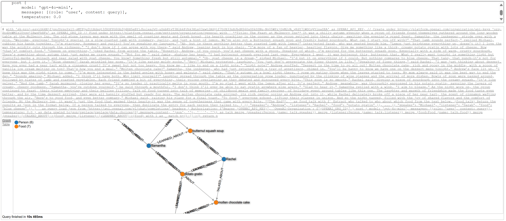

# Cypher.js
Cypher graph database query engine and graph database in Javascript. The Cypher query language in your browser! Zero dependencies

For inquiries, reach out to Cypher.js author Niclas Kjäll-Ohlsson (niclas@fusebase.io).

Demos
1. Just for fun: https://bit.ly/2Dbylrh
2. <a href="https://niclasko.github.io/CypherJS/?CREATE%20(water:Molecule%20{name:%22H\u2082O%22}),%20(coa_sh:Molecule%20{name:%22CoA-SH%22}),%20(nad:Molecule%20{name:%22NAD\u207a%22}),%20(nadh:Molecule%20{name:%22NADH%22}),%20(h:Molecule%20{name:%22H\u207a%22}),%20(co2:Molecule%20{name:%22CO\u2082%22}),%20(gdp:Molecule%20{name:%22GDP%22}),%20(gtp:Molecule%20{name:%22GTP%22}),%20(phosphate:Molecule%20{name:%22P\u1d62%22}),%20(ubiquinone:Molecule%20{name:%22ubiquinone%22}),%20(ubiquinol:Molecule%20{name:%22ubiquinol%22}),%20(acetyl_coa:Molecule%20{name:%22Acetyl%20CoA%22}),%20(oxaloacetate:Molecule%20{name:%22Oxaloacetate%22}),%20(r1:Reaction%20{name:1}),%20(citrate:Molecule%20{name:%22Citrate%22}),%20(citrate_synthase:Enzyme%20{name:%22Citrate%20synthase%22}),%20(oxaloacetate)-[:SUBSTRATE]-%3E(r1),%20(acetyl_coa)-[:SUBSTRATE]-%3E(r1),%20(water)-[:SUBSTRATE]-%3E(r1),%20(r1)-[:PRODUCES]-%3E(citrate),%20(r1)-[:PRODUCES]-%3E(coa_sh),%20(citrate_synthase)-[:CATALYSES]-%3E(r1),%20(r2:Reaction%20{name:2}),%20(cis_aconitate:Molecule%20{name:%22cis-Aconitate%22}),%20(aconitase:Enzyme%20{name:%22Aconitase%22}),%20(citrate)-[:SUBSTRATE]-%3E(r2),%20(r2)-[:PRODUCES]-%3E(cis_aconitate),%20(r2)-[:PRODUCES]-%3E(water),%20(aconitase)-[:CATALYSES]-%3E(r2),%20(r3:Reaction%20{name:3}),%20(isocitrate:Molecule%20{name:%22Isocitrate%22}),%20(cis_aconitate)-[:SUBSTRATE]-%3E(r3),%20(water)-[:SUBSRATE]-%3E(r3),%20(r3)-[:PRODUCES]-%3E(isocitrate),%20(aconitase)-[:CATALYSES]-%3E(r3),%20(r4:Reaction%20{name:4}),%20(oxalosuccinate:Molecule%20{name:%22Oxalosuccinate%22}),%20(isocitrate_dehydrogenase:Enzyme%20{name:%22Isocitrate%20dehydrogenase%22}),%20(isocitrate)-[:SUBSTRATE]-%3E(r4),%20(nad)-[:SUBSTRATE]-%3E(r4),%20(r4)-[:PRODUCES]-%3E(oxalosuccinate),%20(r4)-[:PRODUCES]-%3E(nadh),%20(r4)-[:PRODUCES]-%3E(h),%20(isocitrate_dehydrogenase)-[:CATALYSES]-%3E(r4),%20(r5:Reaction%20{name:5}),%20(alpha_ketoglutarate:Molecule%20{name:%22\u03b1-Ketoglutarate%22}),%20(oxalosuccinate)-[:SUBSTRATE]-%3E(r5),%20(r5)-[:PRODUCES]-%3E(alpha_ketoglutarate),%20(r5)-[:PRODUCES]-%3E(co2),%20(isocitrate_dehydrogenase)-[:CATALYSES]-%3E(r5),%20(r6:Reaction%20{name:6}),%20(succinyl_coa:Molecule%20{name:%22Succinyl-CoA%22}),%20(alpha_ketoglutarate_dehydrogenase:Enzyme%20{name:%22\u03b1-Ketoglutarate%20dehydrogenase%22}),%20(alpha_ketoglutarate)-[:SUBSTRATE]-%3E(r6),%20(nad)-[:SUBSTRATE]-%3E(r6),%20(coa_sh)-[:SUBSTRATE]-%3E(r6),%20(r6)-[:PRODUCES]-%3E(succinyl_coa),%20(r6)-[:PRODUCES]-%3E(nadh),%20(r6)-[:PRODUCES]-%3E(h),%20(r6)-[:PRODUCES]-%3E(co2),%20(alpha_ketoglutarate_dehydrogenase)-[:CATALYSES]-%3E(r6),%20(r7:Reaction%20{name:7}),%20(succinate:Molecule%20{name:%22Succinate%22}),%20(succinyl_coa_synthetase:Enzyme%20{name:%22Succinyl-CoA%20synthetase%22}),%20(succinyl_coa)-[:SUBSTRATE]-%3E(r7),%20(gdp)-[:SUBSTRATE]-%3E(r7),%20(phosphate)-[:SUBSTRATE]-%3E(r7),%20(r7)-[:PRODUCES]-%3E(succinate),%20(r7)-[:PRODUCES]-%3E(coa_sh),%20(r7)-[:PRODUCES]-%3E(gtp),%20(succinyl_coa_synthetase)-[:CATALYSES]-%3E(r7),%20(r8:Reaction%20{name:8}),%20(fumarate:Molecule%20{name:%22Fumarate%22}),%20(succinate_dehydrogenase:Enzyme%20{name:%22Succinate%20dehydrogenase%22}),%20(succinate)-[:SUBSTRATE]-%3E(r8),%20(ubiquinone)-[:SUBSTRATE]-%3E(r8),%20(r8)-[:PRODUCES]-%3E(fumarate),%20(r8)-[:PRODUCES]-%3E(ubiquinol),%20(succinate_dehydrogenase)-[:CATALYSES]-%3E(r8),%20(r9:Reaction%20{name:9}),%20(l_malate:Molecule%20{name:%22\u029f-Malate%22}),%20(fumarase:Enzyme%20{name:%22Fumarase%22}),%20(fumarate)-[:SUBSTRATE]-%3E(r9),%20(water)-[:SUBSTRATE]-%3E(r9),%20(r9)-[:PRODUCES]-%3E(l_malate),%20(fumarase)-[:CATALYSES]-%3E(r9),%20(r10:Reaction%20{name:10}),%20(malate_dehydrogenase:Enzyme%20{name:%22Malate%20dehydrogenase%22}),%20(l_malate)-[:SUBSTRATE]-%3E(r10),%20(nad)-[:SUBSTRATE]-%3E(r10),%20(r10)-[:PRODUCES]-%3E(oxaloacetate),%20(r10)-[:PRODUCES]-%3E(nadh),%20(r10)-[:PRODUCES]-%3E(h),%20(malate_dehydrogenase)-[:CATALYSES]-%3E(r10)%20match%20(a)-[r]-%3E(b)%20return%20a,%20r,%20b">Molecule interactions</a>
2. Game of Thrones: https://bit.ly/2QoBSG9
3. Time series analysis: https://bit.ly/2zSQkzt
4. Generate random strings: https://bit.ly/2FoJcAW
5. Bill of material explosion: https://bit.ly/2DoKJE6
6. <a href="https://niclasko.github.io/CypherJS/?CREATE%20(yoda:Contact%20{name:%20%27Yoda%27,%20email:%20%27yoda@lucasfilm.com%27})%20CREATE%20(lukeskywalker:Contact%20{name:%20%27Luke%20Skywalker%27,%20email:%20%27luke.skywalker@lucasfilm.com%27})%20CREATE%20(chewbacca:Contact%20{name:%20%27Chewbacca%27,%20email:%20%27chewbacca@lucasfilm.com%27})%20CREATE%20(r2d2:Contact%20{name:%20%27R2D2%27,%20email:%20%27r2d2@lucasfilm.com%27})%20CREATE%20(c3po:Contact%20{name:%20%27C3PO%27,%20email:%20%27c3po@lucasfilm.com%27})%20CREATE%20(darthvader:Contact%20{name:%20%27Darth%20Vader%27,%20email:%20%27darth.vader@lucasfilm.com%27})%20CREATE%20(princessleia:Contact%20{name:%20%27Princess%20Leia%27,%20email:%20%27princess.leia@lucasfilm.com%27})%20CREATE%20(hansolo:Contact%20{name:%20%27Han%20Solo%27,%20email:%20%27han.solo@lucasfilm.com%27})%20CREATE%20(obiwankenobi:Contact%20{name:%20%27Obi-Wan%20Kenobi%27,%20email:%20%27obi-wan.kenobi@lucasfilm.com%27})%20CREATE%20(bobafett:Contact%20{name:%20%27Boba%20Fett%27,%20email:%20%27boba.fett@lucasfilm.com%27})%20CREATE%20(jabbathehutt:Contact%20{name:%20%27Jabba%20the%20Hutt%27,%20email:%20%27jaba.the.hutt@lucasfilm.com%27})%20CREATE%20(landocalrissian:Contact%20{name:%20%27Lando%20Calrissian%27,%20email:%20%27lando.calrissian@lucasfilm.com%27})%20CREATE%20(darthmaul:Contact%20{name:%20%27Darth%20Maul%27,%20email:%20%27darth.maul@lucasfilm.com%27})%20CREATE%20(emperorpalpatine:Contact%20{name:%20%27Emperor%20Palpatine%27,%20email:%20%27emperor.palpatine@lucasfilm.com%27})%20CREATE%20(quigonjinn:Contact%20{name:%20%27Qui-Gon%20Jinn%27,%20email:%20%27qui-gon.jinn@lucasfilm.com%27})%20CREATE%20(jarjarbinks:Contact%20{name:%20%27Jar%20Jar%20Binks%27,%20email:%20%27jarjar.binks@lucasfilm.com%27})%20CREATE%20(macewindu:Contact%20{name:%20%27Mace%20Windu%27,%20email:%20%27mace.windu@lucasfilm.com%27})%20CREATE%20(padmeamidala:Contact%20{name:%20%27Padme%20Amidala%27,%20email:%20%27padme.amidala@lucasfilm.com%27})%20CREATE%20(countdooku:Contact%20{name:%20%27Count%20Dooku%27,%20email:%20%27count.dooku@lucasfilm.com%27})%20CREATE%20(generalgrievous:Contact%20{name:%20%27General%20Grievous%27,%20email:%20%27general.grievous@lucasfilm.com%27})%20CREATE%20(jangofett:Contact%20{name:%20%27Jango%20Fett%27,%20email:%20%27jango.fett@lucasfilm.com%27})%20CREATE%20(anakinskywalker:Contact%20{name:%20%27Anakin%20Skywalker%27,%20email:%20%27anakin.skywalker@lucasfilm.com%27})%20CREATE%20(darthsidious:Contact%20{name:%20%27Darth%20Sidious%27,%20email:%20%27darth.sidious@lucasfilm.com%27})%20CREATE%20(darthtyranus:Contact%20{name:%20%27Darth%20Tyranus%27,%20email:%20%27darth.tyranus@lucasfilm.com%27})%20CREATE%20(darthplagueis:Contact%20{name:%20%27Darth%20Plagueis%27,%20email:%20%27darth.plagueis@lucasfilm.com%27})%20CREATE%20(darthbane:Contact%20{name:%20%27Darth%20Bane%27,%20email:%20%27darth.bane@lucasfilm.com%27})%20CREATE%20(darthrevan:Contact%20{name:%20%27Darth%20Revan%27,%20email:%20%27darth.revan@lucasfilm.com%27})%20CREATE%20(darthmalak:Contact%20{name:%20%27Darth%20Malak%27,%20email:%20%27darth.malak@lucasfilm.com%27})%20CREATE%20(georgelucas:Contact%20{name:%20%27George%20Lucas%27,%20email:%20%27george.lucas@lucasfilm.com%27})%20CREATE%20(lucasfilm:Company%20{name:%20%27Lucasfilm%27,%20email:%20%27lucasfilm@lucasfilm.com%27})%20CREATE%20(jedis:Contact:Group%20{name:%20%27Jedis%27,%20email:%20%27jedis@lucasfilm.com%27,%20description:%20%27Jedis%20of%20Lucasfilm.%27})%20CREATE%20(siths:Contact:Group%20{name:%20%27Siths%27,%20email:%20%27siths@lucasfilm.com%27,%20description:%20%27Siths%20of%20Lucasfilm.%27})%20CREATE%20(directors:Contact:Group%20{name:%20%27Directors%27,%20email:%20%27directors@lucasfilm.com%27,%20description:%20%27Directors%20of%20Lucasfilm.%27})%20CREATE%20(yoda)-[:PARENT_GROUP]-%3E(jedis)%20CREATE%20(lukeskywalker)-[:PARENT_GROUP]-%3E(jedis)%20CREATE%20(chewbacca)-[:PARENT_GROUP]-%3E(jedis)%20CREATE%20(r2d2)-[:PARENT_GROUP]-%3E(jedis)%20CREATE%20(c3po)-[:PARENT_GROUP]-%3E(jedis)%20CREATE%20(darthvader)-[:PARENT_GROUP]-%3E(siths)%20CREATE%20(princessleia)-[:PARENT_GROUP]-%3E(jedis)%20CREATE%20(hansolo)-[:PARENT_GROUP]-%3E(jedis)%20CREATE%20(obiwankenobi)-[:PARENT_GROUP]-%3E(jedis)%20CREATE%20(bobafett)-[:PARENT_GROUP]-%3E(siths)%20CREATE%20(jabbathehutt)-[:PARENT_GROUP]-%3E(siths)%20CREATE%20(landocalrissian)-[:PARENT_GROUP]-%3E(jedis)%20CREATE%20(darthmaul)-[:PARENT_GROUP]-%3E(siths)%20CREATE%20(emperorpalpatine)-[:PARENT_GROUP]-%3E(siths)%20CREATE%20(quigonjinn)-[:PARENT_GROUP]-%3E(jedis)%20CREATE%20(jarjarbinks)-[:PARENT_GROUP]-%3E(jedis)%20CREATE%20(macewindu)-[:PARENT_GROUP]-%3E(jedis)%20CREATE%20(padmeamidala)-[:PARENT_GROUP]-%3E(jedis)%20CREATE%20(countdooku)-[:PARENT_GROUP]-%3E(siths)%20CREATE%20(generalgrievous)-[:PARENT_GROUP]-%3E(siths)%20CREATE%20(jangofett)-[:PARENT_GROUP]-%3E(siths)%20CREATE%20(anakinskywalker)-[:PARENT_GROUP]-%3E(jedis)%20CREATE%20(darthsidious)-[:PARENT_GROUP]-%3E(siths)%20CREATE%20(darthtyranus)-[:PARENT_GROUP]-%3E(siths)%20CREATE%20(darthplagueis)-[:PARENT_GROUP]-%3E(siths)%20CREATE%20(darthbane)-[:PARENT_GROUP]-%3E(siths)%20CREATE%20(darthrevan)-[:PARENT_GROUP]-%3E(siths)%20CREATE%20(darthmalak)-[:PARENT_GROUP]-%3E(siths)%20CREATE%20(georgelucas)-[:PARENT_GROUP]-%3E(directors)%20CREATE%20(directors)-[:PARENT_GROUP]-%3E(jedis)%20match%20p=(:Contact)-[:PARENT_GROUP*]-%3E(group:Contact)%20where%20not((group)-[:PARENT_GROUP]-%3E(:Contact))%20unwind%20nodes(p)%20as%20member%20return%20properties(nodes(p)[0])%20as%20character,%20collect(member.name)%20as%20taxonomy">Star Wars characters</a>

#### New! Check out <a href="https://github.com/niclasko/Cypher.js/blob/master/scripts/FoodTalk.cql" target="_blank">this script</a> for how to do prompt chaining, query a LLM API, create and visualize a graph with one Cypher statement in Cypher.js:
<a href="https://github.com/niclasko/Cypher.js/blob/master/scripts/FoodTalk.cql" target="_blank"></a>

## Usage

**Client-side (web browser)**

1. Include
	
	```<script type="text/javascript" src="Cypher.min.js"></script>```

2. Use
	
	```
	var cypher = new Cypher({runInWebWorker: true});
	
	var query = 'merge (n:Test{what:"Hello World"}) return n';
	
	cypher.execute(
		query,
		function(results) {
			console.log(results);
		},
		function(errorText) {
			console.log(errorText);
		}
	);
	```

**Node.js**

```
// Dependency to https package
var https = require("https");

var Cypher = require("Cypher.min.js").Cypher;

var options = {
	// In Node.js the runInWebWorker option must be set to false
	// Web Workers are not supported in Node.js
	runInWebWorker: false,
};
var cypher = new Cypher(options);

cypher.execute(
	'unwind range(0,10) as item return item',
	function(results) {
		console.log(JSON.stringify(results));
	},
	function(error) {
		console.log(error);
	}
);
```
